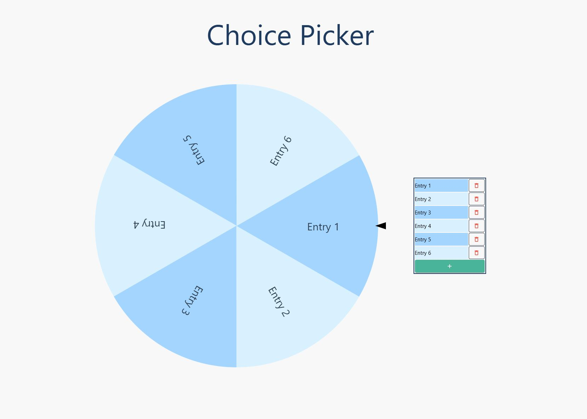

# Choice Wheel

The choice wheel is a spinning circle made up of equal sized wedges that can be used to make make selections.

Tech Stack: Vue 3, Vuetify

Node version: 22.13.0

## Main Points
- The number of entries on the wheel can be altered via an add/remove button and the wheel will adjust the size of each wedge accordingly.
- A random position on the wheel will be calculated when the user clicks on the wheel and the winning entry will be displayed via a modal.
- The wedge dimensions and angles are calculated with javascript and injected into the styles by css-variables.
- The rotation animation is controlled by dynamically appending the CSS `transform` and `transition` styles into the wheel `div`.

## Demo photo

